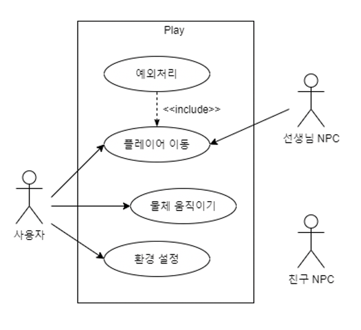

# 한이음 - 불이야! : VR 화재대피훈련
Unity Store에서 구매한 유료 애셋과 고용량 애셋이 존재해 특정 파일의 경우 제외 후 업로드되었습니다!

---

# Summary

### 프로젝트 요약

- 2020 한이음 공모전 출품 작품
    - 최종 성적 - 2차 통과
- 초등학생을 위한 VR 화재대피훈련

### Stack

- Unity 2019.2.8f1 (3D)
- C#

### 기간

- 2020.05.13 ~ 2020.11.30

---

# 프로토타입 시연

* 이미지를 누르면 시연 영상을 보실 수 있습니다.

좌측 상단은 플레이어가 실제로 VR을 조작하는 모습입니다

- 화면 녹화 기능이 좋지 않아 화질이 다소 떨어지는 점 양해 부탁드리겠습니다

# 프로젝트 설명

- 현 공공/교육기관에서 진행되고 있는 화재대피훈련은 현실감이 떨어져 참여자의 적극성이 떨어지고 훈련 내용이 기억에 남지 않는다는 문제점이 있습니다

    → 이러한 문제를 해결하기 위해, 초등학생을 주 대상으로 실제 재난 상황과 비슷하게 대처하는 방법을 체험할 수 있는 VR HMD를 활용한 화재대피 훈련 프로젝트를 개발하게 되었습니다

## 팀원 및 업무 분담

### 개발

- 김조은
- 이영현

### 디자인

- 이가영
    - 학교 외관 및 내부 오브젝트 3D 모델링

## 개발 내용들

## 플레이어 및 등장인물

- UML Diagram

    

### 플레이어 조작 및 이동

- 컨트롤러를 통해 반장 캐릭터를 조작할 수 있습니다
- 플레이어의 조작과 물체와의 상호작용 연결 (ex. 문 열기)
- 선생님 NPC의 내레이션과 바닥의 지시 화살표를 통해 플레이어의 이동이 유도됩니다

### 화재 대피 이동 경로를 안내하는 선생님

- 플레이어가 올바른 화재 대피 경로로 이동할 수 있도록 화면의 지시 메시지로 안내 후 다음 지점으로 이동해 학생이 올 때까지 기다립니다
- 플레이어의 이동 상황에 따라 상황에 맞는 대사를 출력할 수 있도록 구현했습니다

### 친구 NPC

- 선생님과 상호작용 후, 반장을 따라 학생들이 이동합니다

## 배경적 요소

### 바닥의 지시등

- 플레이어의 올바른 이동을 유도
    - 체크 포인트의 경우, 도달시 NPC와의 상호작용 유도

### 지시 메시지

- 선생님의 대사가 화면의 시간초와 함께 지시 메시지로 출력됩니다
- VR 환경에서 헤드셋이 회전되어도 일정한 위치를 유지할 수 있게끔 구현했습니다
